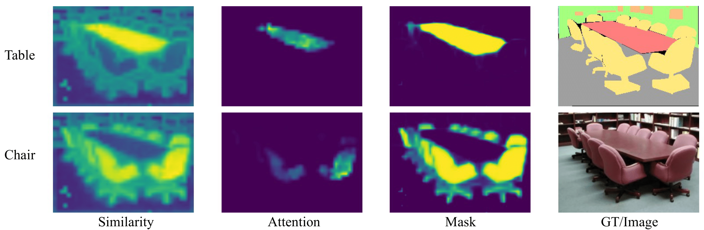
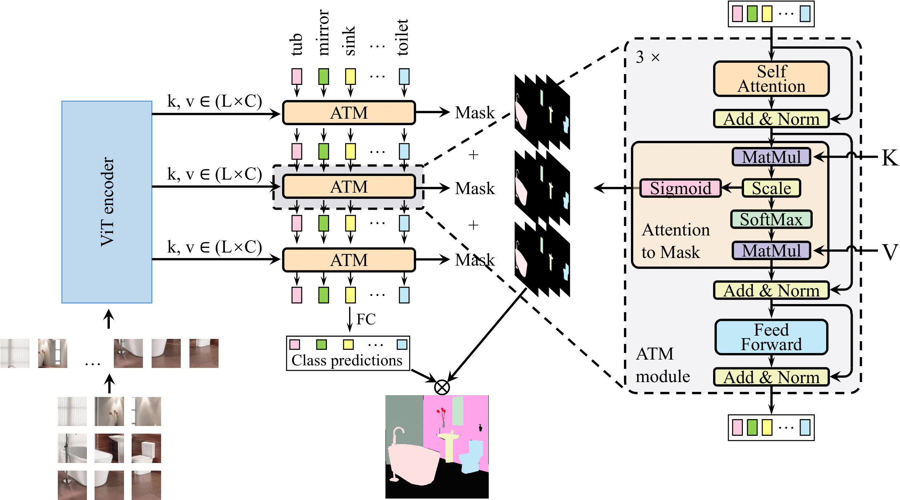

# Official Pytorch Implementation of SegViT

SegViT: Semantic Segmentation with Plain Vision Transformers 

Zhang, Bowen and Tian, Zhi and Tang, Quan and Chu, Xiangxiang and Wei, Xiaolin and Shen, Chunhua and Liu, Yifan.

NeurIPS 2022. [[paper]](https://arxiv.org/abs/2210.05844)

This repository contains the official Pytorch implementation of training & evaluation code and the pretrained models for SegViT.

As shown in the following figure, the similarity between the class query and the image features is transfered to the segmentation mask.






## Highlights
* **Simple Decoder:** The Attention-to-Mask (ATM) decoder provides a simple segmentation head for Plain Vision Transformer, which is easy to extend to other downstream tasks.
* **Light Structure:** We proposed *Shrunk* structure that can save up to **40%** computational cost in a structure with ViT backbone.
* **Stronger performance:** We got state-of-the-art performance mIoU **55.2%** on ADE20K, mIoU **50.3%** on COCOStuff10K, and mIoU **65.3%** on PASCAL-Context datasets with the least amount of computational cost among counterparts using ViT backbone. 


## Getting started 

1. Install the [mmsegmentation](https://github.com/open-mmlab/mmsegmentation) library and some required packages.

```bash
pip install mmcv-full==1.4.4 mmsegmentation==0.24.0
pip install scipy timm
```
## Training
```
python tools/dist_train.sh  configs/segvit/segvit_vit-l_jax_640x640_160k_ade20k.py 
```
## Evaluation
```
python tools/dist_test.sh configs/segvit/segvit_vit-l_jax_640x640_160k_ade20k.py   {path_to_ckpt}
```

## Datasets
Please follow the instructions of [mmsegmentation](https://github.com/open-mmlab/mmsegmentation) data preparation

## Results
| Model backbone        |datasets| mIoU  | mIoU (ms) | GFlops | ckpt
| ------------------ |--------------|---------------- | -------------- |--- |---
Vit-Base | ADE20k | 51.3 | 53.0 | 120.9 |[model](https://cloudstor.aarnet.edu.au/plus/s/k0xOaxYmENt6f0z) 
Vit-Large (Shrunk) | ADE20k | 53.9 | 55.1 | 373.5 | [model](https://cloudstor.aarnet.edu.au/plus/s/eFB9y7CXNfPzjJv)
Vit-Large | ADE20k | 54.6 | 55.2 | 637.9 | [model](https://cloudstor.aarnet.edu.au/plus/s/sMDAzsMjq39bQBD) 
Vit-Large (Shrunk) | COCOStuff10K | 49.1 | 49.4 | 224.8 | [model](https://cloudstor.aarnet.edu.au/plus/s/mIDAyR3jeARcCMq)
Vit-Large | COCOStuff10K | 49.9 | 50.3| 383.9 | [model](https://cloudstor.aarnet.edu.au/plus/s/3XKspneTKPcI3sx)
Vit-Large (Shrunk) | PASCAL-Context (59cls)| 62.3 | 63.7  | 186.9 | [model](https://cloudstor.aarnet.edu.au/plus/s/mMguIaE44lgc2SR)
Vit-Large  | PASCAL-Context (59cls)| 64.1 | 65.3  | 321.6 | [model](https://cloudstor.aarnet.edu.au/plus/s/RGsAybjc5xLwpKK)


## License
For academic use, this project is licensed under the 2-clause BSD License - see the LICENSE file for details. For commercial use, please contact the authors.

## Citation
```
@article{zhang2022segvit,
  title={SegViT: Semantic Segmentation with Plain Vision Transformers},
  author={Zhang, Bowen and Tian, Zhi and Tang, Quan and Chu, Xiangxiang and Wei, Xiaolin and Shen, Chunhua and Liu, Yifan},
  journal={arXiv preprint arXiv:2210.05844},
  year={2022}
}
```
